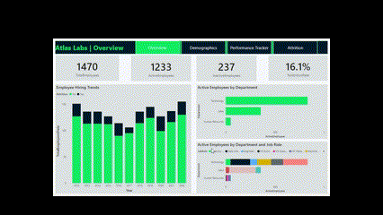
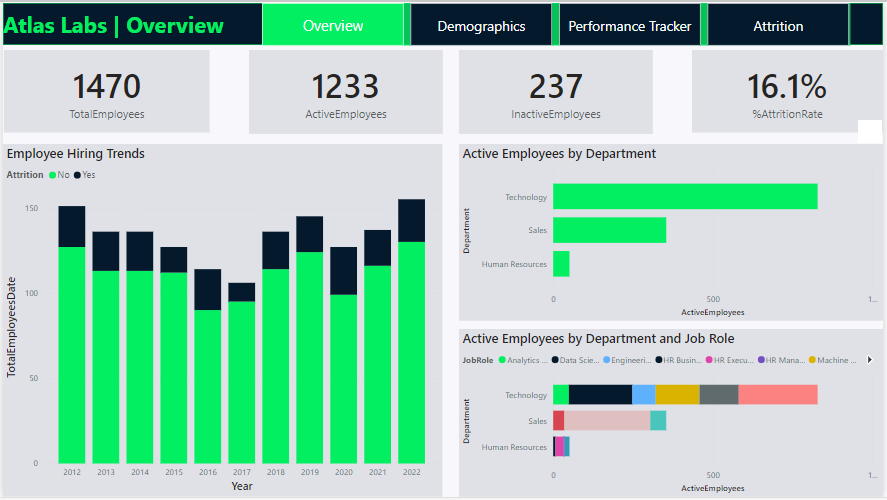
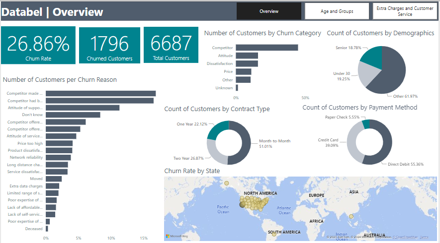

## HR Analytics in Power BI

Atlas Labs is interested in understanding how they are performing in terms
of EDI and employee attrition, they also want to be able to monitor the 
performance of their employees. I analyzed the HR data and found their
total employee to be **1470** with an attrition rate of **16.1%**. Their most active
employees are from the technology dept, in contrast, the sales dept accounted
for the highest attrition rate of **20.6%** mostly within the Sales Rep job role. 
Majority of their employees are between 20-29 with a balance in gender. 
Employees with frequent travels and over time requirements had higher attrition 
rates. The performance tracker page can be used to monitor important metrics for each 
employee annually.

The interactive report in Power BI can be accessed from the overview page below

## Unveiling the Golden Age of Video Games with SQL

This is a fun project where I employed the power of PostgreSQL to reveal the years in 
which game makers, players and critics love the most. There are two datasets, the game_sales 
dimension table and the reviews fact table. The logic was to identify the year where both 
players and critics gave high ratings and had the highest number of games sold. I validated 
the data, used different SQL queries and techniques such as JOINS, WHERE, HAVING(), SET THEORY, 
sub queries, etc to achieve this goal. It turned out that **2008** was the winner for the 3 groups.

## Analyzing Customer Attrition in Excel and Power BI

Databel is a fictional telecom company experiencing customer churn, they
want to understand the root cause of this problem and develop a strategy 
to tackle it. I analyzed the data and found that the current churn rate is
**26.86%**. The main churn reasons are competitor, attitude of support person, 
dissatisfaction and high price. Databel's major customers are between 30-65 yrs, 
on a month-to-month contract and pay with direct debit, they have significantly 
higher churn rate. I also found that customers in a group contract have lower 
monthly charge and churn rate. Customers without unlimited data plan but use 
extra data, those without int plan but call internationally all incur extra charges 
leading to higher customer service calls and churn rate. 

Read full article [here](https://medium.com/@yusufolonade/analyzing-customer-attrition-in-excel-and-power-bi-151cf475694f).
Follow the link in the overview page below to access the interactive report in Power BI.

The Excel version of this project is also available [here](https://github.com/Yusuf-Olonade/DataAnalytics_Projects/blob/main/Customer_Churn_Excel_PowerBI/customer_churn.xlsx).

## Analyzing Product Sales Strategy with Python

A fictional office stationery supply company called Pens and Printers
have just lauched a new product line and have tried different sales strategies
including Email, Call and Email + Call. The goal of this project is to analyze
the data and recommend the best strategy. After my analysis, I found that Email
was the best as it accounted for the highest revenue and quantity of products sold,
about **50%** of the total. It also reached the highest number of customers with 
the fastest response time within **2.5 weeks**. In addition it had the least cost to 
the sales team making it the best strategy to maximize profit.

Read full article [here](https://app.datacamp.com/workspace/w/c55bc135-4d23-4fc5-9d7f-c9c273112851/edit).

